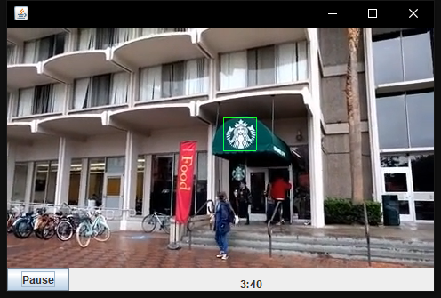

# Multimedia Project - Advertisement Detection and Replacement
## Overview
This project reads and analyzes video and audio files to perform the following:  
* Detect the advertisement sections in the video and audio.
* Detect specific brand logos appeared in the video (excluding the ad section).
* Replace the original advertisement section with a new advertisement corresponding to the logo detected.
* Write new video and audio files with logos appeared in the frames highlighted by a bounding box,
and original advertisements replaced by the new advertisements.
* Play video with the new video and audio files in sync, with pause and resume functionality.

## Team Members
| Name | Email                                |
| --- |--------------------------------------|
| Abiola Johnson | [abiolajo@usc.edu](abiolajo@usc.edu) |
|Kaiyuan Yu | [kaiyuany@usc.edu](kaiyuany@usc.edu) |
|Parthiv Mangukiya | [mangukiy@usc.edu](mangukiy@usc.edu) |
## Data Format
* 🎞️ .rgb: raw video file that contains RGB channel data for frames.
* 🎧 .wav: raw audio file, 48,000 HZ, mono, 16 bits/sample.

## Dependencies 
* Java:
  * json-simple-1.1
* Python:
  * numpy
  * opencv
  * matplotlib
  * google cloud vision

## Detailed Implementations (See Appendix Images for Implementation Logic)
1. Advertisement Detection:
   * Use motion compensation technique, to calculate video frame-wise difference and divide the video into 
   shots (shot boundaries are at those frames where the entropy of motion compensation gets large).
   * Analyze the audio file, find where the audio level exceeds the threshold and changes significantly.
   * Combine shots into scenes, and mark which scenes are advertisements with above video and audio analysis.
   * See appendix image for anatomy of frames, shots, and scenes.
2. Logo Detection:
   * Use Google Cloud Vision, a machine learning approach to find brand logos in video frames.
   * Output a json (see [detector.json](detector.json) for detailed format) file including information of which 
   logos are detected (with their appearing frame index), and the pixel coordinates of their bounding boxes.
3. Output New Video and Audio Files:
   * Write the output video (.rgb) and audio (.wav) files frame by frame. 
   * If the frame contains a logo, write the green channel bounding box coordinates as 255.
   * If the next scene to write is an advertisement section, replace this advertisement scene with a new advertisement
   corresponding to the previous logo detected.
4. Media Player
   * Java GUI that plays video and audio in sync.
   * Play audio buffer of size 3200 bytes, then update 1 frame of video.

## Extra Credit ✌️
* We received extra credit by completing preprocessing of video and audio files within 8 minutes time limit!

## Appendix
* Anatomy of video, scenes, shots and frames:  

* Implementation Logic:

